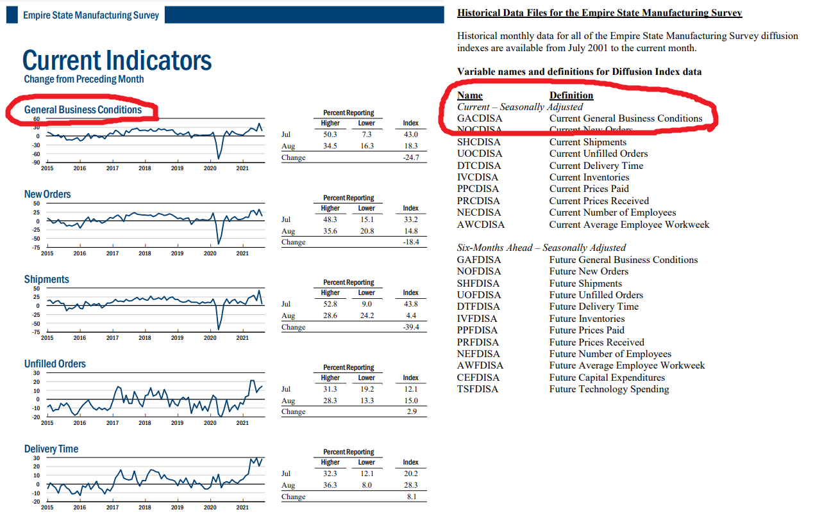
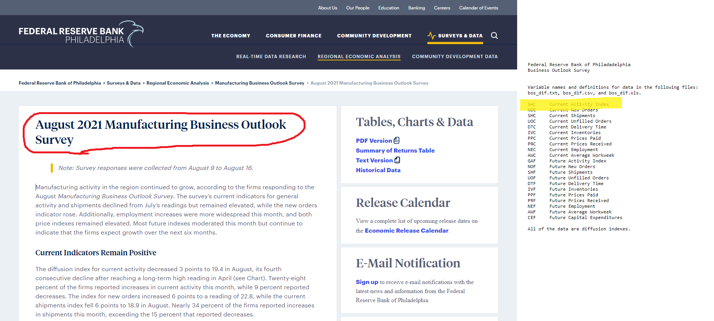
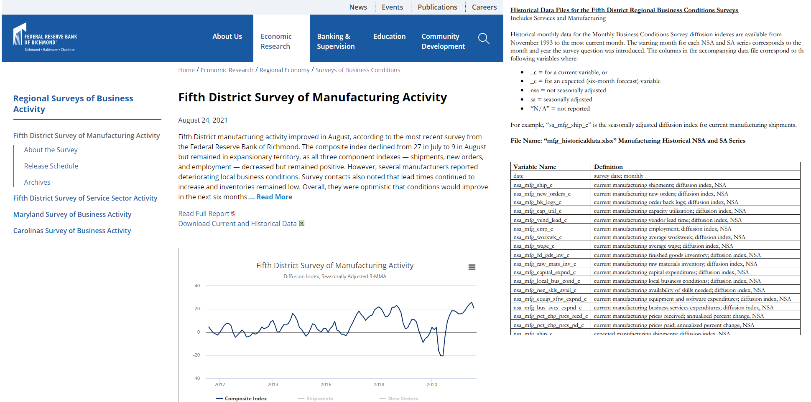
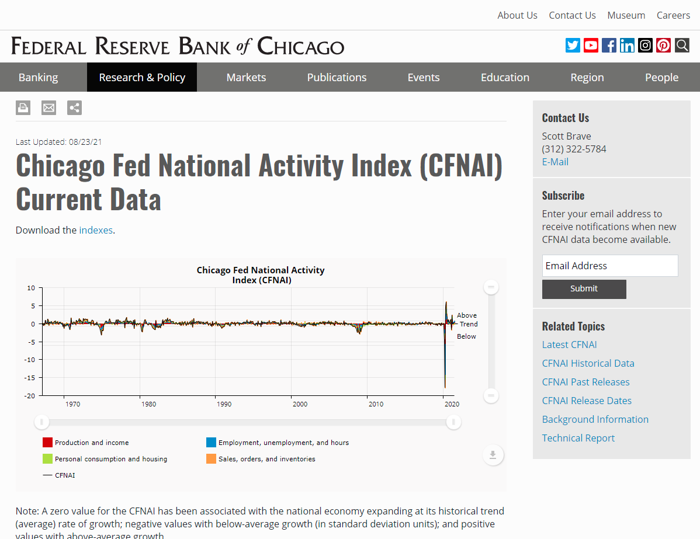
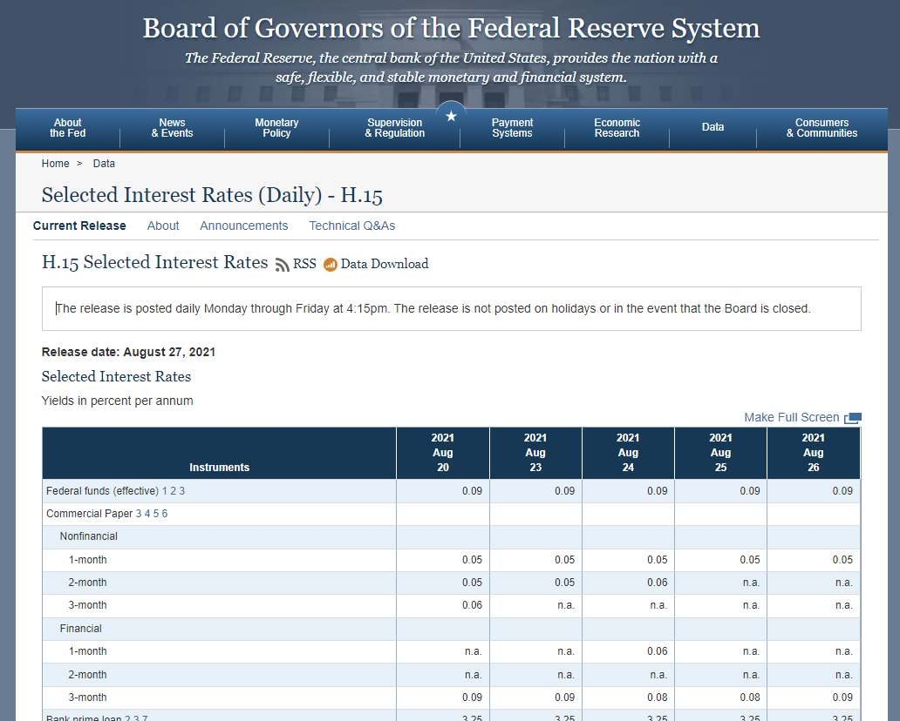
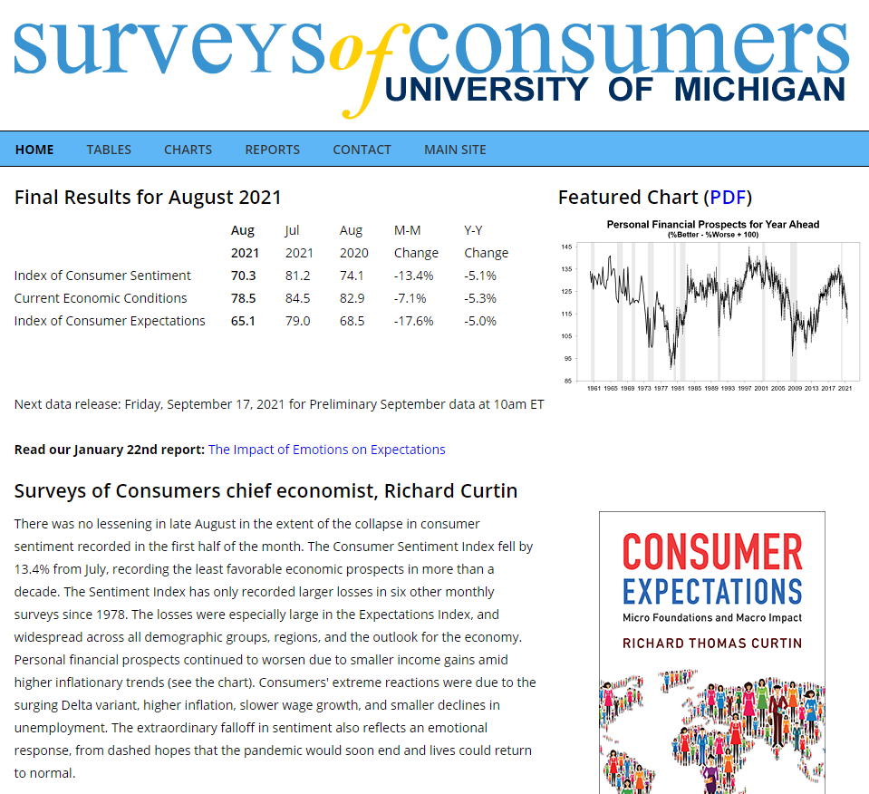
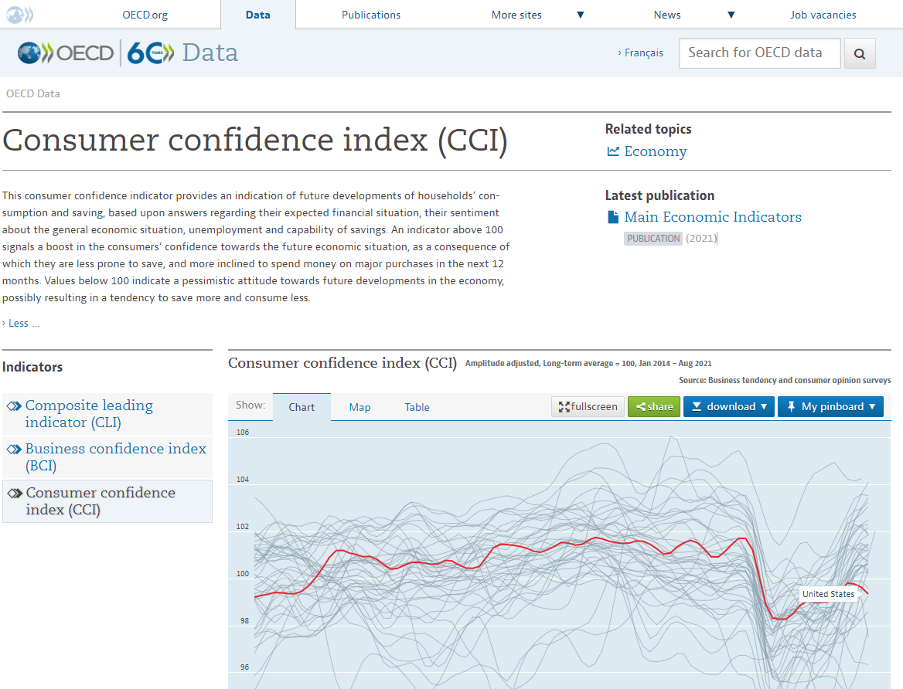
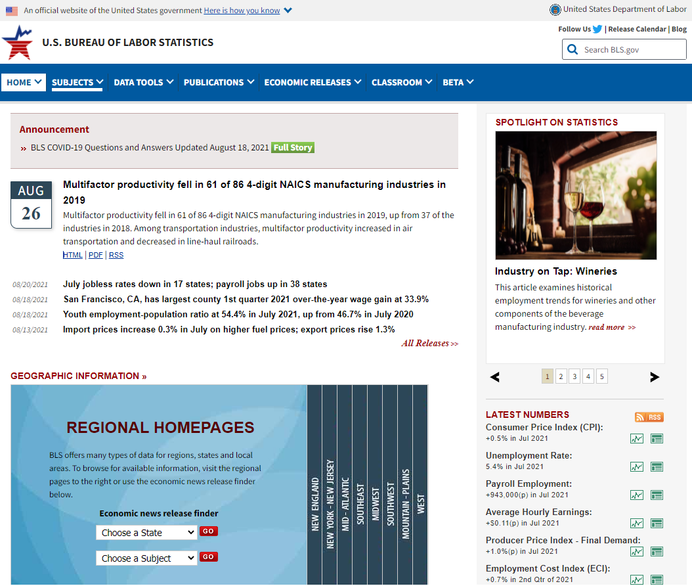
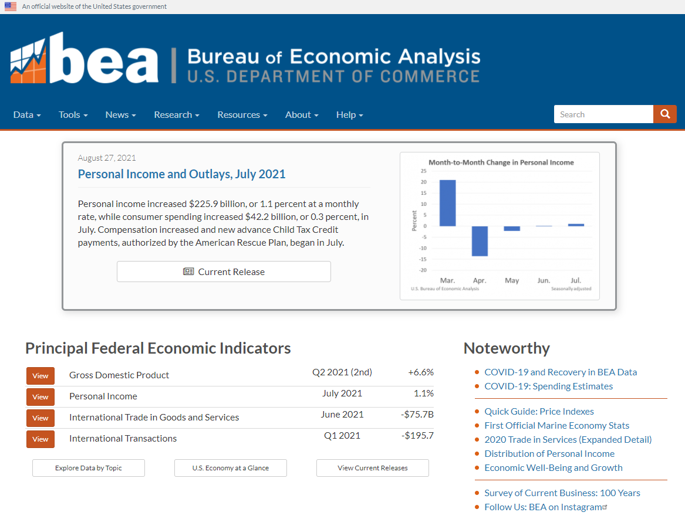
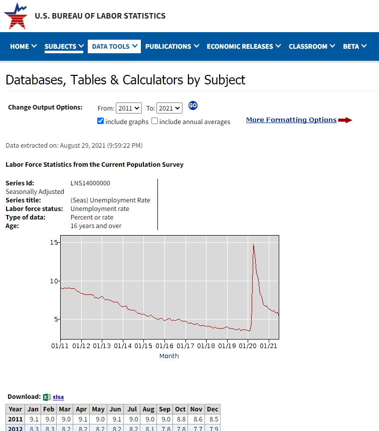

# Economic Indicators Input Files

For the economic indicators, we looked at the following indicators and data:

* *Empire State Manufacturing Survey*  
* *Philadelphia Business Outlook Survey*  
* *Kansas City Manufacturing Survey of the 10th District*  
* *Richmond Fifth District Survey of Manufacturing Activity*  
* *Chicago Fed National Activity Index*  
* *Yield Curve Spreads (2-10, 3mo-10, 5-30)*  
* *Consumer Sentiment*  
* *Consumer Confidence*  
* *CPI*  
* *Personal Income & Spending*  
* *Employment*  

## Empire State Manufacturing Survey

In this survey, we'll be using the seasonally adjusted General Business Conditions to get a sense of how COVID affected the Empire State.

Below is the section of the report and data that we will focus on to gain this insight.

The source for this data is:
<https://www.newyorkfed.org/survey/empire/empiresurvey_overview#tabs-3>

Filename: ESMS_SeasonallyAdjusted_Diffusion.csv

## Philadelphia Business Outlook Survey

In this survey, we'll be using the seasonally adjusted Current Activity Index to get a sense of how COVID affected the Philadelphia region.

Below is the section of the report and data that we will focus on to gain this insight.

The source for this data is:
<https://www.philadelphiafed.org/surveys-and-data/regional-economic-analysis/mbos-2021-08>

Filename: bos_dif.csv

## Kansas City Manufacturing Survey of the 10th District

In this survey, we'll be using the non-seasonally adjusted Composite Index versus a Year Ago to get a sense of how COVID affected the Philadelphia region.

The source for this data is:
<https://www.kansascityfed.org/surveys/manufacturing-survey/>

Filename: ManufSurvey_Augu_PR_2021-8-26-Table2.xlsx

## Richmond Fifth District Survey of Manufacturing Activity

In this survey, we'll be using the seasonally adjusted manufacturing composite diffusion index (variable name = sa_mfg_composite).

The source for this data is:
<https://www.richmondfed.org/research/regional_economy/surveys_of_business_conditions/manufacturing>

Filename: mfg_historicaldata.xlsx

## Chicago Fed National Activity Index

In this survey, we'll be using the Chicago Fed National Activity Index (CFNAI).

The source for this data is:
<https://www.chicagofed.org/research/data/cfnai/current-data>

Filename: cfnai-data-series-xlsx.xlsx

## Yield Curve Spreads (2-10, 3mo-10, 5-30)

For this data, we're evaluating the Treasury yield spreads to see if this gives us any insight into correlations with market movements.

The source for this data is:
<https://www.federalreserve.gov/releases/h15/>

Filename: FRB_H15.csv

## University of Michigan Consumer Sentiment Survey

This data is meant to show whether consumer sentiment is a leading indicator of pending market drops.

The source for this data is:
<http://www.sca.isr.umich.edu/>

Filename: tbmics.csv

## Consumer Confidence Survey

This data is meant to show whether consumer confidence is a leading indicator of pending market drops.

The source for this data is:
<https://data.oecd.org/leadind/consumer-confidence-index-cci.htm>

Filename: DP_LIVE_29082021233211990.csv

## Consumer Price Index

This data is meant to show whether CPI is a leading indicator of pending market drops.

The source for this data is:
<https://www.bls.gov/>

Filename: SeriesReport-20210829174913_8539aa.xlsx

## National Income and Product Accounts - Wages and Salaries

This data is meant to show whether wages are a leading indicator of pending market drops.

The source for this data is:
<https://www.bea.gov/>

Filename: download.csv

## Unemployment Rate

This data is meant to show whether unemployment is a leading indicator of pending market drops.

The source for this data is:
<https://data.bls.gov/timeseries/LNS14000000>

Filename: SeriesReport-20210829220108_b33332.xlsx

