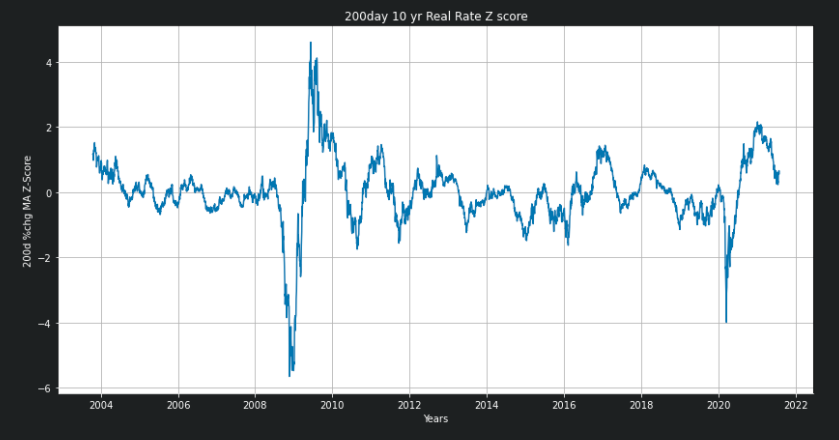
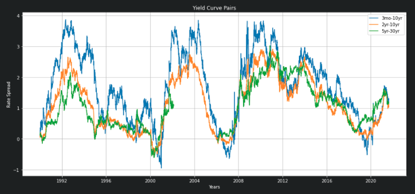

# Economic Indicators Analysis

The purpose of this project is to determine the correlations and linear regression relationships between different economic indicators, and how they change over different regimes of volatility.

Using the following statistical methods, we can uncover the most important economic indicator movements in the different market regimes:

* Mean
* Standard deviation
* Z-scores
* Pearson correlations
* Linear regressions
* Sensitivity analysis
* Rate of change (1st, 2nd, 3rd derivatives)

This data will be used to compare to asset classes such as bonds, stocks, commodities and cryptos, as well as style factors such as short float, beta, and market caps.

